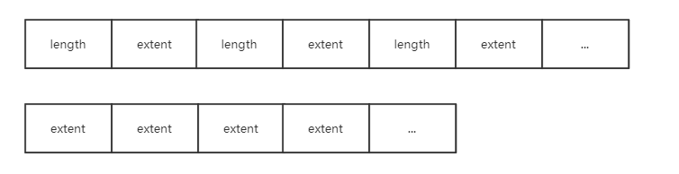
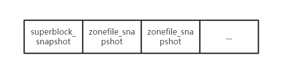
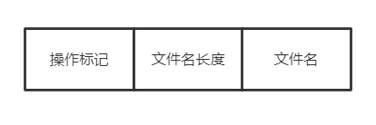
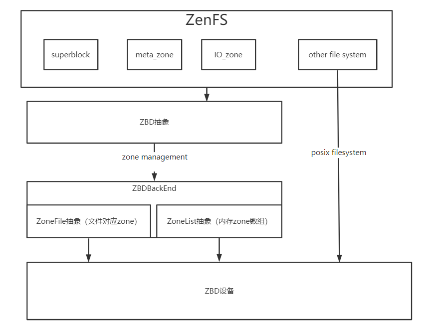

# 作为RocksDB的插件的ZenFs源码剖析


## 底层ZBD相关

代码位于zbd_zenfs.h和zbd_zenfs.cc中

### Zone抽象

```c++
class Zone {
  ZonedBlockDevice *zbd_;
  ZonedBlockDeviceBackend *zbd_be_;
  std::atomic_bool busy_;
  
  uint64_t start_;//起始物理地址
  uint64_t capacity_; /* remaining capacity */
  uint64_t max_capacity_;
  uint64_t wp_;
  Env::WriteLifeTimeHint lifetime_;
  std::atomic<uint64_t> used_capacity_;
}
```

一个Zone需要有所属块设备，起始地址和写指针，生命周期和空间相关的维护。

Zone中的方法有重置Zone，判断是否为空或者是否写满，往写指针后面添加数据等等。

### ZoneList抽象

```c++
class ZoneList {
 private:
  void *data_;
  unsigned int zone_count_;
}
```

ZoneList指的是Zone的list。  

### ZonedBlockDeviceBackend接口

ZonedBlockDeviceBackend是用来和底层设备交互需要经过的接口，这个接口将底层的ZoneList全部抽象成内存中连续的ZoneList并进行操作。

在zbdlib_zenfs.h以及zbdlib_zenfs.cc实现接口以方便上层对底层zbd的访问。

在zonefs_zenfs.h以及zonefs_zenfs.cc的实现是将上层对zbd的访问通过posix的读写文件方式给包装起来。

```c++
class ZonedBlockDeviceBackend {
 public:
  uint32_t block_sz_ = 0;
  uint64_t zone_sz_ = 0;
  uint32_t nr_zones_ = 0;
}
```

backend有两种类型分别是：

```c++
enum class ZbdBackendType {
  kBlockDev,
  kZoneFS,
};
```

### ZonedBlockDevice抽象

```C++
class ZonedBlockDevice {
 private:
  std::unique_ptr<ZonedBlockDeviceBackend> zbd_be_;
  std::vector<Zone *> io_zones;//用于io的zone
  std::vector<Zone *> meta_zones;//用于保存元信息的zone
  time_t start_time_;
  std::shared_ptr<Logger> logger_;
  uint32_t finish_threshold_ = 0;
  std::atomic<uint64_t> bytes_written_{0};
  std::atomic<uint64_t> gc_bytes_written_{0};// 垃圾回收转移的字节数目

  std::atomic<long> active_io_zones_;//分配io_zone时需要用锁
  std::atomic<long> open_io_zones_;
  /* Protects zone_resuorces_  condition variable, used
     for notifying changes in open_io_zones_ */
  std::mutex zone_resources_mtx_;
  std::condition_variable zone_resources_;
  std::mutex zone_deferred_status_mutex_;
  IOStatus zone_deferred_status_;

  std::condition_variable migrate_resource_;
  std::mutex migrate_zone_mtx_;
  std::atomic<bool> migrating_{false};

  unsigned int max_nr_active_io_zones_;
  unsigned int max_nr_open_io_zones_;

  std::shared_ptr<ZenFSMetrics> metrics_;//todo
}
```

#### Open函数

用来打开一个ZonedBlockDevice，流程如下：

1. 首先获取最大活跃io_zones数目和最大可打开io_zones，这里保留了一个zone用于metadata存储（todo：为什么实际上分配了三个zone），一个用于extent migration（todo）。
2. 从backend中获取已有zones分配3个meta_zones。将剩余的非离线状态的可获得的zone放入io_zones中。遍历的过程可统计当前活跃zone的数目

处于离线状态的块，也就是offline，指的是这个zone已经dead了，这里可以理解成已经坏掉了？todo

#### Get*Space函数

顾名思义，用来获取诸如已经使用空间，空闲空间以及可回收空间大小

#### Log*函数

用来输出日志，获取zone的整体使用情况，每个zone单个使用情况以及垃圾空间占比等。

#### 分配zone区域方法

ZonedBlockDevice重要的功能应该是操作zone。

首先是分配释放相关操作：

1. ApplyFinishThreshold将剩余空间小于预设的块给finish掉，finish操作指的是把一个zone的写指针移动到zone末尾，剩余容量减为0。

2. FinishCheapestIOZone将一个最小剩余空间的zone给finish。
3. GetBestOpenZoneMatch将一个当前的文件生命周期和每一个io_zone进行生命周期对比，分配一个生命周期大于当前文件的生命周期且最接近的zone。
4. AllocateEmptyZone，顾名思义是分配一块空的zone。
5. ReleaseMigrateZone，顾名思义是释放migrate_zone (todo migrate zone是用来干嘛的)。
6. TakeMigrateZone，选择一块最优zone当作migrate_zone。
7. AllocateIOZone，在保持max_active_io_zones的数量的前提下分配一块zone。

8. Read，从偏移offset处读n个byte吧应该是，这里边用了ZonedDeviceBackend提供的Read接口。

此外还有一些有趣的方法比如说Read用ZonedBlockDeviceBackend实现的Read实现zone的读，以及一些设置zone的默认状态的方法。

## 实现ZonedBlockDeviceBackend接口

在前面已经提到过：

在zbdlib_zenfs.h以及zbdlib_zenfs.cc实现接口以方便上层对底层zbd的访问。

在zonefs_zenfs.h以及zonefs_zenfs.cc的实现是将上层对zbd的访问通过posix的读写文件方式给包装起来。

### zbdlib_zenfs

zbdlib实现的接口更加接近于zbd的底层，它将zbd中的所有zone的元信息（struct zone）作为一个数组读到内存，通过元信息和zbd底层的接口进行交互。

### zonefs_zenfs

zonefs中用操作系统的读写路径来操作zone，将每个zone抽象成一个文件进行读写。

这里采用LRU的策略维护内存中文件句柄的队列。

## Snapshot

### ZBD设备快照

```c++
class ZBDSnapshot {
 public:
  uint64_t free_space;//空闲空间
  uint64_t used_space;//已使用空间
  uint64_t reclaimable_space;//可回收空间
}
```

ZBD设备快照记录设备的空闲空间（free_space），已使用空间（used_space）和可回收空间（reclaimable_space）。

### Zone快照

```c++
class ZoneSnapshot {
 public:
  uint64_t start;//Zone开始地址
  uint64_t wp;//写指针

  uint64_t capacity;//容量
  uint64_t used_capacity;//已用容量
  uint64_t max_capacity;//最大容量
}
```

Zone快照记录了Zone区域的开始地址（start），写指针（wp），以及容量相关信息。

### ZoneExtent快照

```c++
class ZoneExtentSnapshot {
 public:
  uint64_t start;//todo
  uint64_t length;//Extent长度
  uint64_t zone_start;//todo
  std::string filename;//Extent所属文件名
}
```

### ZoneFile快照

```c++
class ZoneFileSnapshot {
 public:
  uint64_t file_id;//顾名思义 file的id
  std::string filename;//文件名
  std::vector<ZoneExtentSnapshot> extents;//文件的extents快照集合
}
```

论文中提到过一个文件拥有多个extent，extent不会跨Zone存储，在这些数据结构中可以看出端倪。

### ZenFs快照

```c++
class ZenFSSnapshot {
 public:
  ZBDSnapshot zbd_;
  std::vector<ZoneSnapshot> zones_;
  std::vector<ZoneFileSnapshot> zone_files_;
  std::vector<ZoneExtentSnapshot> extents_;
};
```

这里的快照便是之前所有快照的组合，所以ZenFs的内部结构也可以看的比较清楚。

## io_zenfs

ZoneFs的文件内容是由多个extent组成的，每个extent都放在一个zone里面，extent不能跨zone存储。

在io_zenfs.h中定义了一些关键的数据结构，首先是extent：

```c++
class ZoneExtent {
 public:
  uint64_t start_;// 物理起始地址
  uint64_t length_;// extent的长度
  Zone* zone_;// 所属zone指针

  explicit ZoneExtent(uint64_t start, uint64_t length, Zone* zone);
  Status DecodeFrom(Slice* input);
  void EncodeTo(std::string* output);
  void EncodeJson(std::ostream& json_stream);
};
```

其次是zonefile:

```c++
class ZoneFile {
 private:
  const uint64_t NO_EXTENT = 0xffffffffffffffff;

  ZonedBlockDevice* zbd_;

  std::vector<ZoneExtent*> extents_;
  std::vector<std::string> linkfiles_;

  Zone* active_zone_;
  uint64_t extent_start_ = NO_EXTENT;
  uint64_t extent_filepos_ = 0;

  Env::WriteLifeTimeHint lifetime_;
  IOType io_type_; /* Only used when writing */
  uint64_t file_size_;
  uint64_t file_id_;

  uint32_t nr_synced_extents_ = 0;
  bool open_for_wr_ = false;
  std::mutex open_for_wr_mtx_;

  time_t m_time_;
  bool is_sparse_ = false;
  bool is_deleted_ = false;

  MetadataWriter* metadata_writer_ = NULL;

  std::mutex writer_mtx_;// zonefs的读写锁
  std::atomic<int> readers_{0};

 public:
  static const int SPARSE_HEADER_SIZE = 8;
 }
```

zonefile在操作时只会操作一个active_zone，同时文件记录了生命周期，读写锁等等。

其中实现的方法有稀疏文件append，所谓稀疏文件就是除了在zone中保存了有效数据信息之外还保存了有效数据的长度信息，如下图所示：



sparse方式的zone中会将长度记录计入，而普通的zone只会一直append文件中的extent。

除此之外，zonefs还有实现了RocksDB的FSWritableFile接口以支持顺序写的方法，实现了FSSequentialFile接口以实现顺序读，FSRandomAccessFile接口以实现随机读。

## fs_zenfs

fs_zenfs.h和fs_zenfs.cc中记录的是最为核心的zenfs的文件逻辑。

### 首先是超级快superblock：

```c++
class Superblock {
  uint32_t magic_ = 0;
  char uuid_[37] = {0};
  uint32_t sequence_ = 0;
  uint32_t superblock_version_ = 0;
  uint32_t flags_ = 0;
  uint32_t block_size_ = 0; /* in bytes */
  uint32_t zone_size_ = 0;  /* in blocks */
  uint32_t nr_zones_ = 0;
  char aux_fs_path_[256] = {0};
  uint32_t finish_treshold_ = 0;
  char zenfs_version_[64]{0};
  char reserved_[123] = {0};
 }
```

### 然后是重要的zenmetalog，用于记录操作和恢复用：

```C++
class ZenMetaLog {
  uint64_t read_pos_;
  Zone* zone_;
  ZonedBlockDevice* zbd_;
  size_t bs_;
}
```

zenmetalog加入的record是如下形式，首先存储的是由长度和数据形成的冗余码，然后是数据长度，再是实际的数据。


每一次roll的操作都会重新开一个zone来记录metadata信息，时机是当这个zone写满了todo，而一个新的metazone的内容首先会加入下面内容，此时记录的是文件系统的瞬时状态也即snapshot，当然这些snapshot是用record的形式加入的：



在update，replace或是delete文件时，都会按照如下格式包装成record加入metalog：

manipulate_form



### ZenFs文件系统：

```C++
class ZenFS : public FileSystemWrapper {
  ZonedBlockDevice* zbd_;
  std::map<std::string, std::shared_ptr<ZoneFile>> files_;// ZoneFile
  std::mutex files_mtx_;
  std::shared_ptr<Logger> logger_;
  std::atomic<uint64_t> next_file_id_;

  Zone* cur_meta_zone_ = nullptr;
  std::unique_ptr<ZenMetaLog> meta_log_;// 元信息
  std::mutex metadata_sync_mtx_;
  std::unique_ptr<Superblock> superblock_;// 超级块

  std::shared_ptr<Logger> GetLogger() { return logger_; }

  std::unique_ptr<std::thread> gc_worker_ = nullptr;// 垃圾回收
  bool run_gc_worker_ = false;
}
```

#### GC_WORKER垃圾回收

当全局zone里边的free空间小于一定比例之后，gc_worker便开始了垃圾回收工作，核心思想便是：

收集需要垃圾回收的zone，即zone的剩余空间满足一定的条件就进行回收，之后将zone中对应的extent移动到与当前zonefile生命周期相匹配的zone，这个zone是顺序写的，这个移动extent的操作叫做migrate操作。

#### MOUNT逻辑

1. 读入所有metazone并且读出superblock，选择seq序号最大的superblock的meta作为恢复zone。
2. 若是readonly的，则从磁盘同步一次数据。
3. 若是可写的，并且用一个新的metazone记录当前文件系统的瞬时状态（superblock以及各个zonefile的编码）。同时要将系统的未用zone重置一下。最后开启垃圾回收线程。

#### MKFS逻辑

1. 选择一个metazone作为log记录的zone。
2. 写入superblock和各个zonfile编码到metazone中。

## ZenFs整体框架

基于理解，绘制出ZenFs框架图如下：




