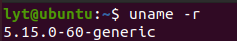
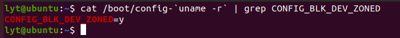
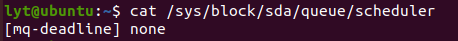
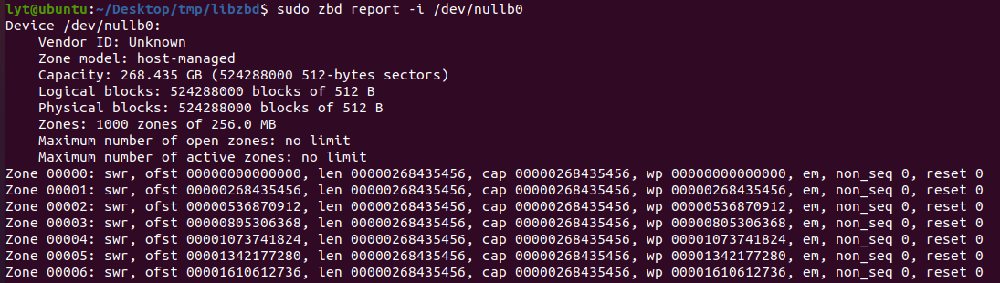
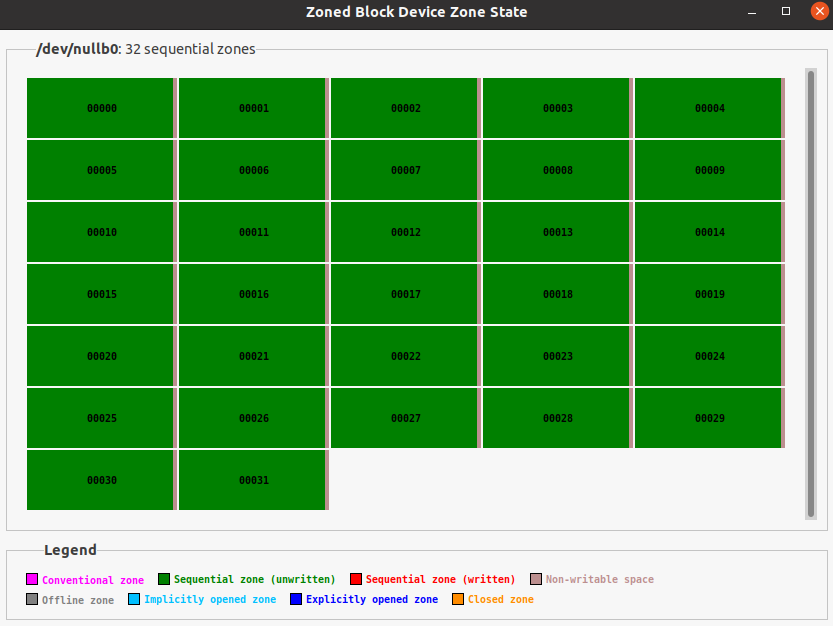
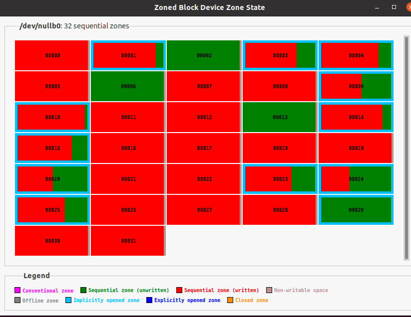
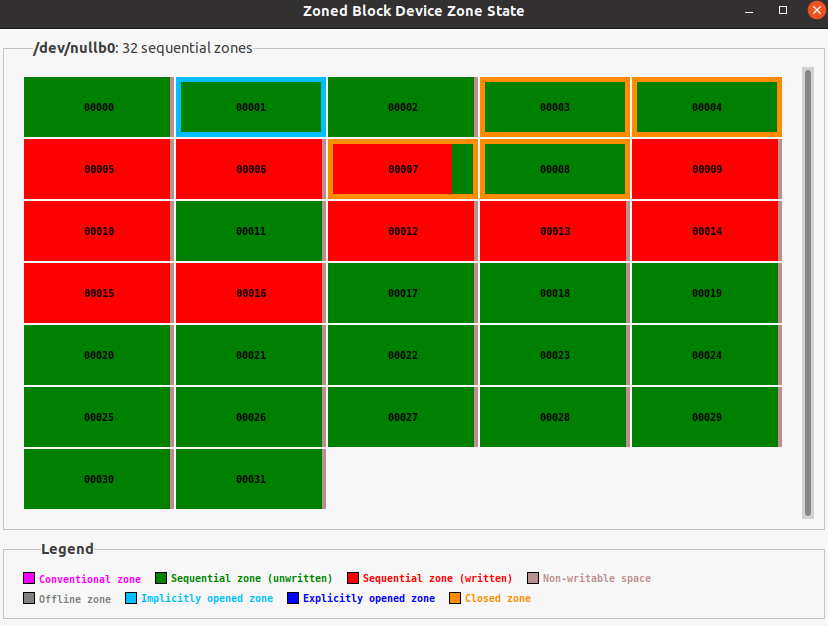
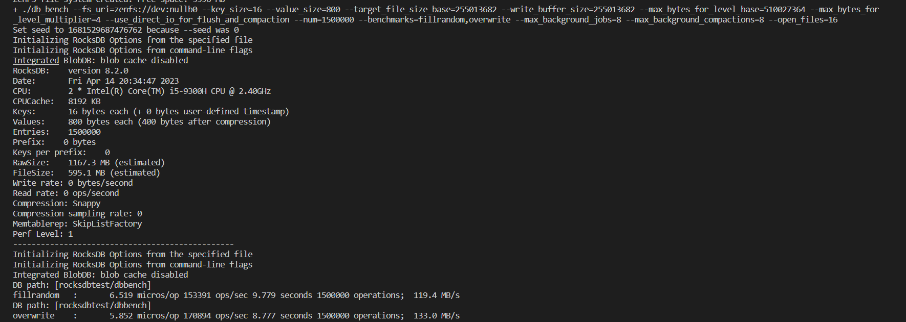

# ZNS设备模拟

## 1.Setting-up a Zoned Storage Compatible Linux System

### Overview

1. [A compatible Linux distribution](https://zonedstorage.io/docs/getting-started/linux#linux-distribution) with the right kernel version
2. [Support for zoned block devices](https://zonedstorage.io/docs/getting-started/linux#checking-a-systems-configuration)
3. [Necessary system utilities](https://zonedstorage.io/docs/getting-started/linux#system-utilities)

配置ZNS需要正确的内核版本以能够支持相应的版本，首先建立可以和zoned storage相兼容的linux system。

### Linux Distribution

一些linux发行版本提供了zoned storage的支持，这些发行版本的常规安装提供了可以支持SMR硬盘和ZNS SSDs的支持。

这里采用Ubuntu 20.04跑在VMWare上的虚拟机作为安装的linux system。

当然也可以用其他的版本,下载的发行版本需要满足两个条件：

1. The kernel version [must be 4.10.0 or higher](https://zonedstorage.io/docs/getting-started/linux#checking-the-kernel-version).
2. The kernel configuration option [*CONFIG_BLK_DEV_ZONED* must be enabled](https://zonedstorage.io/docs/getting-started/linux#checking-zoned-block-device-support).

install Fedora can be found [here](https://docs.fedoraproject.org/en-US/fedora/f33/install-guide/).

#### 1.测试内核版本：

```shell
uname -r
```



#### 2.用以下两条命令来检测是否支持Zoned Block Device:

```shell
cat /boot/config-`uname -r` | grep CONFIG_BLK_DEV_ZONED
cat /lib/modules/`uname -r`/config | grep CONFIG_BLK_DEV_ZONED
```



#### 3.检查系统配置

##### write ordering control

linux内核并不保证命令到达设备的顺序，这意味到达磁盘的写命令顺序可能会打乱，因此可能造成写错误。为了避免这个错误，"zone write lock mechanism" 用来顺序化这些操作。

查看block I/O调度器：

```shell
# cat /sys/block/sdb/queue/scheduler
[none] mq-deadline kyber bfq
```



如果不是mq-deadline的调度器，需要切换成mq-deadline的调度器：

```shell
# echo mq-deadline > /sys/block/sdb/queue/scheduler

# cat sys/block/sdb/queue/scheduler
[mq-deadline] kyber bfq none
```

##### System Utilities

按照说明里边我只找到了lsblk指令，其他的诸如没找到sg3_utils，lsscsi等。

不过在ubuntu里边可以用zbd这个指令来和blkzone起到类似的效果，这个命令是用来看zone的信息的。

安装libzbd的过程如下：

首先libzbd需要下面的package进行编译：

```shell
# 如果想要有图形化界面的gzbd和gzbd-viewer的话 还需要首先安装libgtk-3-dev这个包
# sudo apt install libgtk-3-dev
# apt-get install autoconf
# apt-get install autoconf-archive
# apt-get install automake
# apt-get install libtool
# apt-get install m4
```

同时系统需要有blkzoned.h，头文件在/usr/include/linux里边可以找一下：

```shell
sudo ls /usr/include/linux/ | grep blkzoned
```

然后把libzbd的包下下来，在已经下载的文件夹里面编译一遍：

```shell
git clone https://github.com/westerndigitalcorporation/libzbd.git
sh ./autogen.sh
./configure
make
```

默认下载在/usr.lib或者/usr/lib64下。

不过这个在Ubuntu22.04里边有个zbd-utils可以直接用apt下载。

## 2.Zoned Block Device模拟方法

最简单的方法是创建null block的方式来模拟block device

### 简单创建方法

创建一个null block块：

```shell
modprobe null_blk nr_devices=1 zoned=1
```

`nr_devices=1`表示仅创建一个设备；`zoned=1`表示创建的所有设备都是分区设备。

可以用lsblk来查看一下信息：


可以看到我们创建了一个nullb0的设备。

还可以用zbd来查看分区块设备的信息：



删除一个由`modprobe`创建（且不由`configfs`创建）的模拟设备可用以下方法删除：

```shell
rmmod null_blk
```

### 高级创建方法

```shell
# modprobe null_blk nr_devices=1 \
    zoned=1 \
    zone_nr_conv=4 \
    zone_size=64 \
```

`nr_devices=1`表示仅创建一个设备；

`zoned=1`表示创建的所有设备都是分区设备；

`zone_nr_conv=4`表示传统的Zone个数为4；

`zone_size=64`表示每个Zone有64MB。

`configfs`接口为创建模拟分区块设备提供了强大的手段。`configfs`可供修改的参数如下：

```shell
# cat /sys/kernel/config/nullb/features
memory_backed,discard,bandwidth,cache,badblocks,zoned,zone_size,zone_capacity,zone_nr_conv,zone_max_open,zone_max_active,blocksize,max_sectors,virt_boundary
```

需要注意的是不同内核版本可修改的参数是不一样的：

| kernel |        feature        |
| :----: | :-------------------: |
| 4.10.0 |         zoned         |
| 4.10.0 |     chunk_sectors     |
| 4.20.0 |       nr_zones        |
| 5.8.0  | zone_append_max_bytes |
| 5.9.0  |    max_open_zones     |
| 5.9.0  |   max_active_zones    |

`configfs`接口可以用来用脚本创建具有不同zone配置的模拟zone块设备。
创建内容如下的脚本：

```shell
#!/bin/bash

if [ $# != 4 ]; then
        echo "Usage: $0 <sect size (B)> <zone size (MB)> <nr conv zones> <nr seq zones>"
        exit 1
fi

scriptdir=$(cd $(dirname "$0") && pwd)

modprobe null_blk nr_devices=0 || return $?

function create_zoned_nullb()
{
        local nid=0
        local bs=$1
        local zs=$2
        local nr_conv=$3
        local nr_seq=$4

        cap=$(( zs * (nr_conv + nr_seq) ))

        while [ 1 ]; do
                if [ ! -b "/dev/nullb$nid" ]; then
                        break
                fi
                nid=$(( nid + 1 ))
        done

        dev="/sys/kernel/config/nullb/nullb$nid"
        mkdir "$dev"

        echo $bs > "$dev"/blocksize
        echo 0 > "$dev"/completion_nsec
        echo 0 > "$dev"/irqmode
        echo 2 > "$dev"/queue_mode
        echo 1024 > "$dev"/hw_queue_depth
        echo 1 > "$dev"/memory_backed
        echo 1 > "$dev"/zoned

        echo $cap > "$dev"/size
        echo $zs > "$dev"/zone_size
        echo $nr_conv > "$dev"/zone_nr_conv

        echo 1 > "$dev"/power

        echo mq-deadline > /sys/block/nullb$nid/queue/scheduler

        echo "$nid"
}

nulldev=$(create_zoned_nullb $1 $2 $3 $4)
echo "Created /dev/nullb$nulldev"
```

运行脚本，脚本的四个参数分别为：

1. 模拟设备的扇区大小（bytes）
2. 模拟设备的zone大小（MiB）
3. 传统zone个数
4. 有顺序写限制的zone个数

运行结果如下：

```shell
# ./nullblk-zoned.sh 4096 64 4 8 
Created /dev/nullb0
# zbd report -i /dev/nullb0
Device /dev/nullb0:
    Vendor ID: Unknown
    Zone model: host-managed
    Capacity: 0.805 GB (1572864 512-bytes sectors)
    Logical blocks: 196608 blocks of 4096 B
    Physical blocks: 196608 blocks of 4096 B
    Zones: 12 zones of 64.0 MB
    Maximum number of open zones: no limit
    Maximum number of active zones: no limit
Zone 00000: cnv, ofst 00000000000000, len 00000067108864, cap 00000067108864
Zone 00001: cnv, ofst 00000067108864, len 00000067108864, cap 00000067108864
Zone 00002: cnv, ofst 00000134217728, len 00000067108864, cap 00000067108864
Zone 00003: cnv, ofst 00000201326592, len 00000067108864, cap 00000067108864
Zone 00004: swr, ofst 00000268435456, len 00000067108864, cap 00000067108864, wp 00000268435456, em, non_seq 0, reset 0
Zone 00005: swr, ofst 00000335544320, len 00000067108864, cap 00000067108864, wp 00000335544320, em, non_seq 0, reset 0
Zone 00006: swr, ofst 00000402653184, len 00000067108864, cap 00000067108864, wp 00000402653184, em, non_seq 0, reset 0
Zone 00007: swr, ofst 00000469762048, len 00000067108864, cap 00000067108864, wp 00000469762048, em, non_seq 0, reset 0
Zone 00008: swr, ofst 00000536870912, len 00000067108864, cap 00000067108864, wp 00000536870912, em, non_seq 0, reset 0
Zone 00009: swr, ofst 00000603979776, len 00000067108864, cap 00000067108864, wp 00000603979776, em, non_seq 0, reset 0
Zone 00010: swr, ofst 00000671088640, len 00000067108864, cap 00000067108864, wp 00000671088640, em, non_seq 0, reset 0
Zone 00011: swr, ofst 00000738197504, len 00000067108864, cap 00000067108864, wp 00000738197504, em, non_seq 0, reset 0


```

用脚本创建的分区块设备的删除也需要使用脚本：

```shell
#!/bin/bash

if [ $# != 1 ]; then
    echo "Usage: $0 <nullb ID>"
    exit 1
fi

nid=$1

if [ ! -b "/dev/nullb$nid" ]; then
    echo "/dev/nullb$nid: No such device"
    exit 1
fi

echo 0 > /sys/kernel/config/nullb/nullb$nid/power
rmdir /sys/kernel/config/nullb/nullb$nid

echo "Destroyed /dev/nullb$nid"
```

运行结果如下：

```shell
# ./nullblk-del.sh 0
Destroyed /dev/nullb0
```

## 3.在ZONED BLOCK DEVICE上模拟ZenFS

好了，现在我们可以来基于zbd建立zenfs的文件系统。

记得要把之前的libzbd安装了。

首先建立一个null_blk的zone device block，利用如下脚本：

```shell
#!/bin/bash

if [ $# != 7 ]; then
        echo "Usage: $0 <sect size (B)> <zone size (MB)> <zone capacity (MB)> <nr conv zones> <nr seq zones> <max active zones> <max open zones>"
        exit 1
fi

scriptdir="$(cd "$(dirname "$0")" && pwd)"

modprobe null_blk nr_devices=0 || return $?

function create_zoned_nullb()
{
        local nid=0
        local bs=$1
        local zs=$2
        local zc=$3
        local nr_conv=$4
        local nr_seq=$5
        local max_active_zones=$6
        local max_open_zones=$7

        cap=$(( zs * (nr_conv + nr_seq) ))

        while [ 1 ]; do
                if [ ! -b "/dev/nullb$nid" ]; then
                        break
                fi
                nid=$(( nid + 1 ))
        done

        dev="/sys/kernel/config/nullb/nullb$nid"
        mkdir "$dev"

        echo $bs > "$dev"/blocksize
        echo 0 > "$dev"/completion_nsec
        echo 0 > "$dev"/irqmode
        echo 2 > "$dev"/queue_mode
        echo 1024 > "$dev"/hw_queue_depth
        echo 1 > "$dev"/memory_backed
        echo 1 > "$dev"/zoned

        echo $cap > "$dev"/size
        echo $zs > "$dev"/zone_size
        echo $zc > "$dev"/zone_capacity
        echo $nr_conv > "$dev"/zone_nr_conv
        echo $max_active_zones > "$dev"/zone_max_active
        echo $max_open_zones > "$dev"/zone_max_open

        echo 1 > "$dev"/power

        echo mq-deadline > /sys/block/nullb$nid/queue/scheduler

        echo "$nid"
}

nulldev=$(create_zoned_nullb $1 $2 $3 $4 $5 $6 $7)
echo "Created /dev/nullb$nulldev"
```

然后设置对应的参数

```Shell
chmod +x nullblk-zoned.sh
sudo ./nullblk-zoned.sh 512 128 124 0 32 12 12
```

这样一个zbd就在建立好了，可以用lsblk命令查看一下，现在应该有了一个叫做/dev/nullb0的设备，不过是空的，再用gzbd-viewer查看一下这个设备：



之后我们可以利用fio向里面写入数据，首先下载fio：

```shell
git clone https://github.com/axboe/fio.git
cd fio
./configure
make -j$(nproc --all)
sudo make install
```

再往里面写入数据：

```shell
sudo fio --name=test --filename=/dev/nullb0 --zonemode=zbd --direct=1 --runtime=5 --ioengine=io_uring --hipri --rw=randwrite --iodepth=1 --bs=16K --max_open_zones=12
```

可以用gzbd-viewer查看zbd的情况：



最后我们利用脚本在nullb0上创建一个zenfs文件系统：

```shell
#!/bin/sh -ex

DEV=nullb0
FUZZ=5
ZONE_SZ_SECS=$(cat /sys/class/block/$DEV/queue/chunk_sectors)
ZONE_CAP=$((ZONE_SZ_SECS * 512))
BASE_FZ=$(($ZONE_CAP  * (100 - $FUZZ) / 100))
WB_SIZE=$(($BASE_FZ * 2))

TARGET_FZ_BASE=$WB_SIZE
TARGET_FILE_SIZE_MULTIPLIER=2
MAX_BYTES_FOR_LEVEL_BASE=$((2 * $TARGET_FZ_BASE))

MAX_BACKGROUND_JOBS=8
MAX_BACKGROUND_COMPACTIONS=8
OPEN_FILES=16

echo deadline > /sys/class/block/$DEV/queue/scheduler
./plugin/zenfs/util/zenfs mkfs --zbd=$DEV --aux_path=/tmp/zenfs_$DEV --finish_threshold=0 --force
./db_bench --fs_uri=zenfs://dev:$DEV --key_size=16 --value_size=800 --target_file_size_base=$TARGET_FZ_BASE \
 --write_buffer_size=$WB_SIZE --max_bytes_for_level_base=$MAX_BYTES_FOR_LEVEL_BASE \
 --max_bytes_for_level_multiplier=4 --use_direct_io_for_flush_and_compaction \
 --num=1500000 --benchmarks=fillrandom,overwrite --max_background_jobs=$MAX_BACKGROUND_JOBS \
 --max_background_compactions=$MAX_BACKGROUND_COMPACTIONS --open_files=$OPEN_FILES
```

用gzbd-viewer看一下写入数据：



在db_bench上进行测试：



在zenfs的tests目录中可以对文件系统进行测试。

