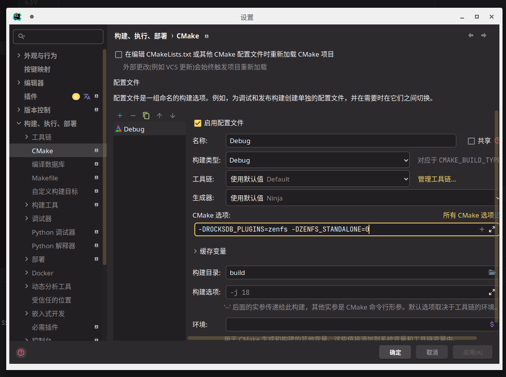

## Get Started

### Build

#### Standalone Mode

这个模式用于尽量剥离 RocksDB 相关代码逻辑，加快编译调试速度

*目前暂时不可用于读写性能测试*。

#### Plugin Mode

原 ZenFS 项目构建方式。

```shell
# 从我们 Fork 的项目 Clone，并且同时同步子项目
git clone https://github.com/RethinkFS/rocksdb -b aquafs --recursive
```

此时 `plugin/zenfs` 和 `plugin/aquafs` 被作为子项目的形式 checkout 到对应路径，二者是地位等同的 RocksDB 插件，通过 `fs_uri` 指定。

从命令行构建：

```shell
# 需要额外设置参数 ZENFS_STANDALONE=0；需要额外加载 libsnappy 作为压缩库
cmake -B build -S . -DROCKSDB_PLUGINS="aquafs zenfs" -DAQUAFS_STANDALONE=0 -DWITH_SNAPPY=1
# 构建
cmake --build build
```

在 IDEA 中构建：



构建 `db_bench` 用于性能测试：

```shell
# 命令行构建，需要额外设置参数 DEBUG_LEVEL=0 以及 数据收集用 prometheus
cmake -B build -S . \
    -DROCKSDB_PLUGINS="aquafs zenfs" -DAQUAFS_STANDALONE=0 -DWITH_SNAPPY=1 -DAQUAFS_EXPORT_PROMETHEUS=1
# 构建
cmake --build build
# 创建两个 nullblk 设备：nullb0 nullb1
sudo ./plugin/aquafs/tests/nullblk/nullblk-zoned.sh 4096 32 0 64
sudo ./plugin/aquafs/tests/nullblk/nullblk-zoned.sh 4096 32 0 64
cd build
# 对单个设备测试
## 创建文件系统
mkdir -p /tmp/aquafs
sudo ./plugin/aquafs/aquafs mkfs --zbd nullb0 --aux-path /tmp/aquafs
## 跑分
sudo ./db_bench --fs_uri=aquafs://dev:nullb0 \
    --benchmarks=fillrandom --use_direct_io_for_flush_and_compaction --use_stderr_info_logger
# 对两个设备的 RAID 测试
## 创建文件系统
mkdir -p /tmp/aquafs
sudo ./plugin/aquafs/aquafs mkfs --raids=raida:dev:nullb0,dev:nullb1 --aux-path /tmp/aquafs
## 跑分
sudo ./db_bench --fs_uri=aquafs://raida:dev:nullb0,dev:nullb1 \
    --benchmarks=fillrandom --use_direct_io_for_flush_and_compaction --use_stderr_info_logger
```

或者在 IDEA 中添加 `-DDEBUG_LEVEL=0` 然后选择 `db_bench` 目标进行构建。

> `db_bench` 的一些有用的参数：
>
> 1. `--fs_uri=aquafs://raida:dev:nullb0,dev:nullb1`
>
>    用于指定测试中的存储文件系统。`aquafs://` 则为使用我们修改后的文件系统，`zenfs://` 则为原文件系统。
>
> 2. `--benchmarks=fillrandom`
>
>    选择需要运行的测试。可用的测试：
>
>    ```
>    	"fillseq,"
>        "fillseqdeterministic,"
>        "fillsync,"
>        "fillrandom,"
>        "filluniquerandomdeterministic,"
>        "overwrite,"
>        "readrandom,"
>        "newiterator,"
>        "newiteratorwhilewriting,"
>        "seekrandom,"
>        "seekrandomwhilewriting,"
>        "seekrandomwhilemerging,"
>        "readseq,"
>        "readreverse,"
>        "compact,"
>        "compactall,"
>        "flush,"
>        "compact0,"
>        "compact1,"
>        "waitforcompaction,"
>        "multireadrandom,"
>        "mixgraph,"
>        "readseq,"
>        "readtorowcache,"
>        "readtocache,"
>        "readreverse,"
>        "readwhilewriting,"
>        "readwhilemerging,"
>        "readwhilescanning,"
>        "readrandomwriterandom,"
>        "updaterandom,"
>        "xorupdaterandom,"
>        "approximatesizerandom,"
>        "randomwithverify,"
>        "fill100K,"
>        "crc32c,"
>        "xxhash,"
>        "xxhash64,"
>        "xxh3,"
>        "compress,"
>        "uncompress,"
>        "acquireload,"
>        "fillseekseq,"
>        "randomtransaction,"
>        "randomreplacekeys,"
>        "timeseries,"
>        "getmergeoperands,",
>        "readrandomoperands,"
>        "backup,"
>        "restore"
>    ```
>
> 3. `--use_direct_io_for_flush_and_compaction`
>
>    当使用 DirectIO 的时候，数据请求将不会经过 Kernel，而是直接访问设备，能够有效降低访问延迟，提高带宽。
>
> 4. `--use_stderr_info_logger`
>
>    将 `stderr` 作为 `logger` 的输出。
