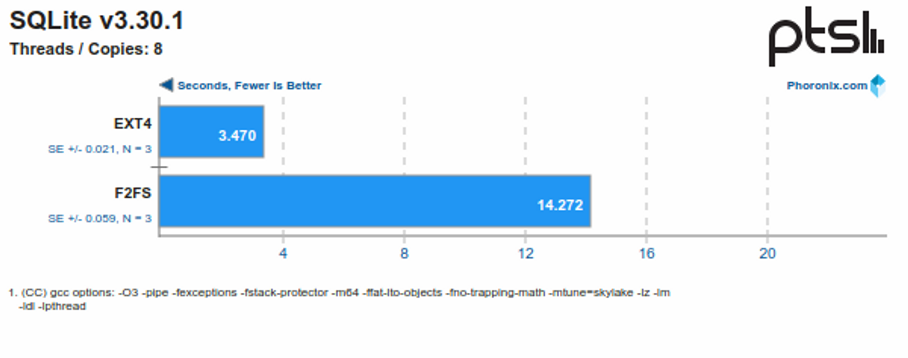

# F2FS

#### LFS

日志中包含索引信息，文件可以被高效的读出。为了快速的写入需要保留大块的空闲区域，可以将日志分成多个固定大小的连续空间——段（segment），在空闲区域不足时通过在碎片化的段中搬移有效数据回收新的连续空间。

日志结构文件系统如此优秀的写入性能不是没有代价的，如何高效的进行垃圾回收同时保持较高的写入性能，特别是剩余空间较少、碎片化严重后的性能一直是众多日志结构文件系统致力于解决的问题。

**Checkpoint**

文件系统某一时刻的快照。指文件系统某一时点所有文件系统有效数据、索引结构一致完整的记录。

创建检查点通常分两步：

1. 落盘所有文件数据、索引、inode表、段使用情况表
2. 在固定的检查点区记录所有有效的inode表和段使用情况表地址以及时间戳等。为了应对检查点过程中的系统崩溃，实际有两个检查点区交替更新（？）。由于时间戳是检查点最后更新的内容，每次重启后只需选择最新的检查点区即可保证有效性。在恢复到检查点后，还可根据日志记录继续前向恢复（roll-forward）数据。F2FS就针对单个文件的fsync实现了前向恢复能力，fsync时只需落盘文件数据和其直接索引。

除了超级块和检查点是保存在固定位置的，其他元数据和数据都是异地更新的日志。

#### F2FS

**NAT**

直接指向数据块的索引节点存的是虚拟地址，实际地址要到NAT表里查找，在更新数据时只需要更新NAT表，不需要递归地更新各级索引节点。（!）

**inline data**

支持数据直接存储在inode中。

**冷热数据分离**

将数据区划分为多个不同冷热程度的Zone。如：目录文件的inode和直接索引更新频繁计入热节点区，多媒体文件数据和回收中被搬移的数据计入冷数据区。冷热分离的目的是使得各个区域数据更新的频率接近。冷数据大多数保持有效因而无需搬移，热数据大多数更新后处于无效状态只需少量搬移。目前F2FS的冷热分离还较为简单，结合应用场景有很大的优化空间。（！）

**垃圾回收**

F2FS的垃圾回收Garbage Collection（GC）分为前台GC和后台GC。当没有足够空闲Section时会触发前台GC，内核线程也会定期执行后台GC尝试清理。另外F2FS也会预留少量空间，保证GC在任何情况下都有足够空间存放搬移数据。GC过程分三步：

1）搬移目标选择，两个著名的选择算法分别是贪心和成本最优（cost-benefit）。 贪心算法挑选有效块最少的Section，一般用于前台GC以减少对IO的阻塞时间。 Cost-benefit算法主要用于后台GC，综合了有效块数和Section中段的年龄（由SIT中Segment的更新时间计算）。该算法的主要思想是识别出冷数据进行搬移，热数据可能再接下来一段时间被更新无需搬移，这也是进行动态冷热分离的又一次机会。

2）识别有效块并搬移，从SIT中可以获取所有有效块，然后在SSA中可以检索其父亲节点块信息。对于后台GC，F2FS并不会立即产生迁移块的I/O，而只是将相关数据块读入页缓存并标记为脏页交由后台回写进程处理。这个方式既能减少对其他I/O的影响，也有聚合、消除小的分散写的作用。

3） 后续处理，迁移后的Section被标记为“预释放”状态，当下一个检查点完成中Section才真正变为空闲可被使用。因为检查点完成之前掉电后会恢复到前一个检查点，在前一个检查点中该Section还包含有效数据。

当空闲空间不足时，F2FS也不是“一根筋”的继续保持日志写的方式（Normal Logging）。直接向碎片化的Segment中的无效块写入数据是日志结构文件系统的另一个日志策略（Threaded Logging），又被称为SSR（Slack Space Recycling）。SSR虽然变成了随机写，但避免了被前台GC阻塞。同时通过以贪心方式选择做SSR的Section，写入位置仍然有一定的连续性。

***\**\*\*\*\*\*\*\*F2FS性能对比\*\*\*\*\*\*\*\*\****

[F2FS vs. EXT4 File-System Performance With Intel's Clear Linux](https://www.phoronix.com/review/clear-linux-f2fs/2)

1. SQLite 非常快

   

2. 随机读写比 Ext4 稍微弱

3. 文件系统同步（sync）性能比 Ext4 好很多

4. PostgreSQL 测试 F2FS 比 Ext4 性能差了一大截

5. Systemd 启动，F2FS 比 Ext4 慢

**已知的问题**

https://wiki.archlinux.org/title/F2FS

1. 版本稳定性问题：

   如果在运行机器上的内核版本旧于用于创建分区的内核版本，则F2FS分区中包含的数据可能无法使用。例如，如果F2FS分区是在由[linux](https://archlinux.org/packages/?name=linux)提供的主线内核上创建的，但系统需要降级到由[linux-lts](https://archlinux.org/packages/?name=linux-lts)提供的较旧的内核系列，则可能会出现此限制。请参见[FS#69363](https://bugs.archlinux.org/task/69363)。

2. 磁盘修复问题 fsck failures

   F2FS的fsck弱，如果突然断电可能会导致数据丢失 **[[3\]](https://www.usenix.org/system/files/atc19-jaffer.pdf)[[4\]](https://web.archive.org/web/20200925120546/https://archived.forum.manjaro.org/t/record-fsync-data-failed-on-f2fs-file-system-how-to-fix-foregt-the-help-i-reinstalled-its-just-easier/121051)**。如果频繁出现断电情况，考虑使用其他 **[文件系统](https://wiki.archlinux.org/title/File_system)**。

3. GRUB 启动问题

   尽管 GRUB 自 2.0.4 版本支持 F2FS，但它无法从启用了 `extra_attr` 标志的 F2FS 分区正确读取其引导文件（有关更多详细信息，请参见 **[GRUB＃不支持的文件系统](https://wiki.archlinux.org/title/GRUB#Unsupported_file_systems)**）。

4. 写入放大问题，造成 SSD 寿命缩短

5. Nand 过度配置问题

6. 段清理开销

7. 元数据更新开销

8. 文件碎片

9. 冷热数据识别不够智能

### F2FS 优化分析

F2FS 的缺点和可优化点包括：段清理开销、元数据更新开销、文件碎片、顺序读取性能差等。这些优化点与以下论文相关联：

- When F2FS Meets Address Remapping：利用地址重映射技术来弥补 F2FS 中的缺陷，达到原地更新的效果，避免段清理、元数据更新和文件碎片的问题。
- M2H: Optimizing F2FS via Multi-log Delayed Writing and Modified Segment Cleaning based on Dynamically Identified Hotness：基于动态识别热点，利用多日志延迟写入和修改段清理来优化 F2FS 的性能。
- Mitigating Synchronous I/O Overhead in File Systems on Open-Channel SSDs：通过引入内置的持久暂存层来提供对闪存友好的数据布局，以提供平衡的读取、写入和垃圾收集性能。
- Optimizing Fragmentation and Segment Cleaning for CPS based Storage Devices：提出了多级阈值同步写入方案和高检测频率背景段清理方案来减少段清理的开销。
