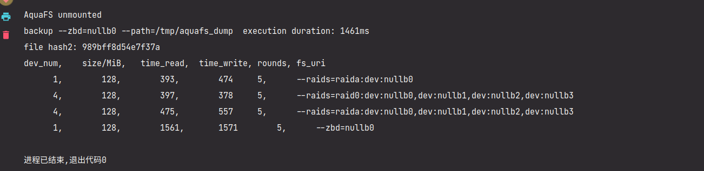

## TODO List

### RAID

- [ ] 完善数据恢复逻辑

  - [x] 当读写发现读写错误，且出错分区可以被数据恢复，则立即开始恢复数据。

  - [x] 先写入一个大文件，然后软件上设置一个块为 `Offline` ，然后在读取的过程中自动修复

    

- [ ] 完善分区 RAID 自动映射逻辑

  - [x] 从命令行配置：如果访问到非映射区域则添加哪一种类型的 RAID 分区
  - [ ] 持久化分区存储配置

- [ ] 添加 `io_uring` 等异步优化

  - [x] `liburing4cpp` 添加和测试
  - [x] 为全盘 RAID0 模式添加 `io_uring`
    1. 将一个请求划分到不同设备和分区并进行分组和排序
    2. 将请求参数加入 RingBuf，有并行和串行逻辑
    3. 请求并等待请求结束
  - [x] 为分区 RAID0 添加 `io_uring`
  - [x] 使用 C++20 的协程使 `io_uring` 请求更加并行化

  协程和 `io_uring` 运行中的效果：

  

- [ ] 测试

  - [x] 可量化的 RAID 效果测试：

    

    通过在读写函数中加上高精度延时模拟磁盘读写延迟，按照访问延迟和数据传输延迟延时，然后计量函数运行时间。

    仍无法使用 `nvmevirt` 等更合理的软件仿真方式。

  - [x] 程序性能测试

    利用 perf 分析性能热点，效果为大都集中在 Kernel 内部的 IO 路径上

    

- [ ] RAID5 逻辑

- [ ] 文档

  - [x] **摘要**
  - [x] 概述
  - [x] 需求分析与调研
    - [x] 需求分析
    - [x] 往年队伍实现的分析
    - [x] 将原来调研的文档改改格式加进来
      - [x] Flash 调研
      - [x] ZenFS 调研
  - [x] 系统设计部分
  - [x] 系统实现部分
    - [x] 全盘 RAID 实现
    - [x] 分区 RAID 实现
    - [x] 分区 RAID 故障处理
    - [x] IO 加速
    - [x] 智能调参
  - [x] 总结和展望
  - [x] 参考文献
  - [ ] git 首页
    - [x] 添加测试效果图表
    - [x] 添加图表说明
    - [x] 完善一下在这里的摘要
      - [x] 创新点和特色（已经实现的和将要实现的）
    - [x] 完善一下主要工作和完成度、工作量
    - [ ] 整理提交，将 `submodule` 改成 `branch`
  - [x] 图表
    - [x] 调参性能图表和说明

